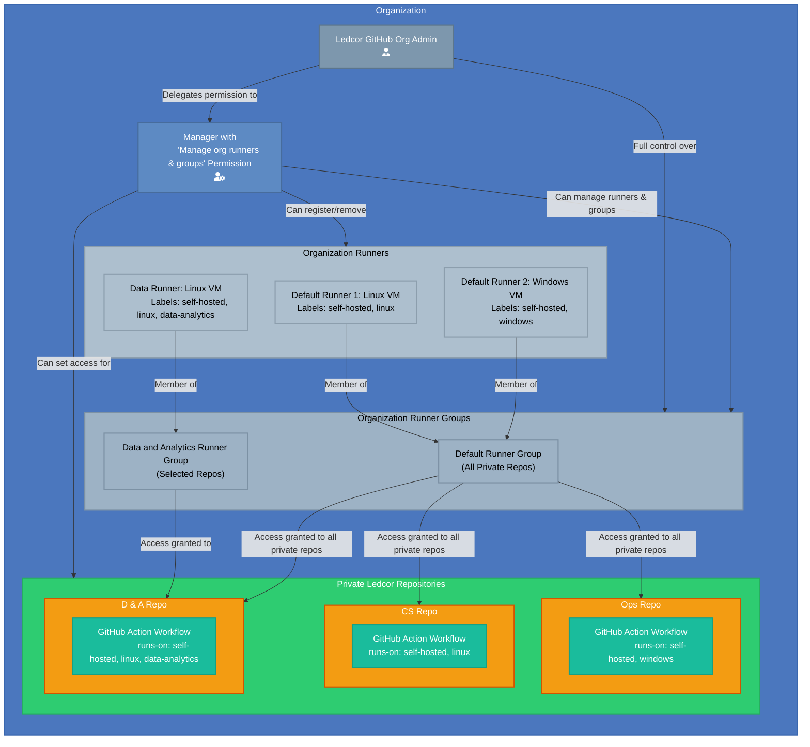

# Manage self-hosted runners using groups

> To control access to runners at the organization level, organizations using the GitHub Team plan can use runner groups. Runner groups are used to collect sets of runners and create a security boundary around them.

See: [Managing access to self-hosted runners using groups](https://docs.github.com/en/actions/hosting-your-own-runners/managing-self-hosted-runners/managing-access-to-self-hosted-runners-using-groups)

