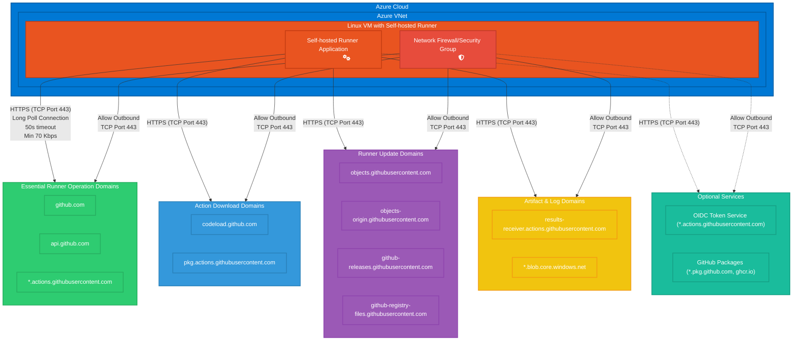

# GitHub Self-Hosted Runner - Outbound Network Requirements

> Since the self-hosted runner opens a connection to GitHub, you do not need to allow GitHub to make inbound connections to your self-hosted runner.
>
> You must ensure that the machine has the appropriate network access with at least 70 kilobits per second upload and download speed to communicate with the GitHub hosts listed below. Some hosts are required for essential runner operations, while other hosts are only required for certain functionality.

See: [Communicating with self-hosted runners](https://docs.github.com/en/actions/hosting-your-own-runners/managing-self-hosted-runners/communicating-with-self-hosted-runners)

