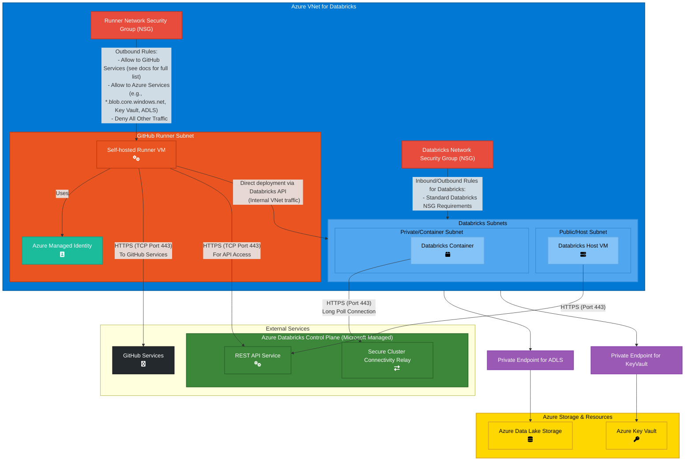

# Databricks-specific GitHub self-hosted runner recommendation

## Notes

Given the volume and complexity of the network requirements for Databricks in Azure, it is recommended to co-locate a dedicated GitHub self-hosted runner ***within*** the Databrick VNet for this use case.

