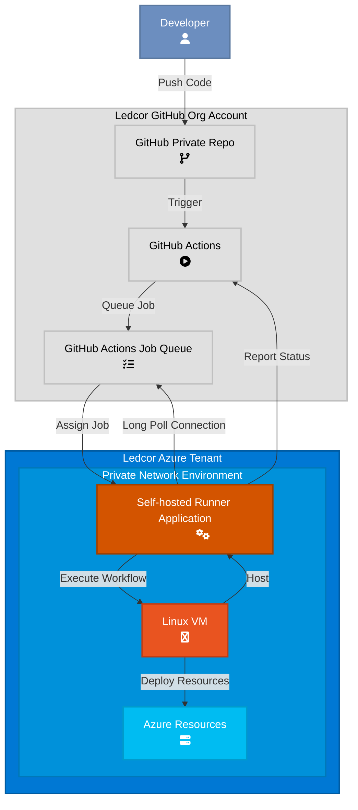

# Overall GitHub self-hosted runner design

see: [About self-hosted runners](https://docs.github.com/en/actions/hosting-your-own-runners/managing-self-hosted-runners/about-self-hosted-runners)

```mermaid

flowchart TD
    %% GitHub Components
    subgraph GH["Ledcor GitHub Org Account"]
        GHRepo["GitHub Private Repo
        fa:fa-code-branch"]
        GHAction["GitHub Actions
        fa:fa-play-circle"]
        JobQueue["GitHub Actions Job Queue
        fa:fa-tasks"]
    end
    
    %% Leccor Azure
    subgraph AZ["Ledcor Azure Tenant"]
        subgraph PrivateNetworkEnv["Private Network Environment"]
            Runner["Linux VM
            fa:fa-linux"]
            RunnerApp["Self-hosted Runner Application
            fa:fa-cogs"]
            Resources["Azure Resources
            fa:fa-server"]
        end
    end
    
    %% Connections
    Dev["Developer
    fa:fa-user"] -->|"Push Code"| GHRepo
    GHRepo -->|"Trigger"| GHAction
    GHAction -->|"Queue Job"| JobQueue
    RunnerApp -->|"Long Poll Connection"| JobQueue
    JobQueue -->|"Assign Job"| RunnerApp
    Runner -->|"Host"| RunnerApp
    RunnerApp -->|"Execute Workflow"| Runner
    Runner -->|"Deploy Resources"| Resources
    RunnerApp -->|"Report Status"| GHAction
    
    %% Styling
    classDef github fill:#E0E0E0,color:black,stroke:#C0C0C0,stroke-width:2px
    classDef azure fill:#0078D4,color:white,stroke:#005BA1,stroke-width:2px
    classDef vnet fill:#0091DA,color:white,stroke:#0078B8,stroke-width:2px
    classDef runner fill:#E95420,color:white,stroke:#C33C12,stroke-width:2px
    classDef runnerapp fill:#D35400,color:white,stroke:#A04000,stroke-width:2px
    classDef targetenv fill:#00BCF2,color:white,stroke:#009BCC,stroke-width:2px
    classDef user fill:#6C8EBF,color:white,stroke:#5A789F,stroke-width:2px
    
    class GH,GHRepo,GHAction,JobQueue github
    class AZ azure
    class PrivateNetworkEnv vnet
    class Runner runner
    class RunnerApp runnerapp
    class Resources targetenv
    class Dev user
```

